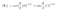
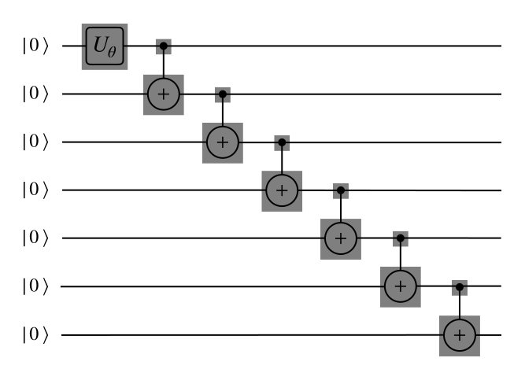
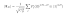
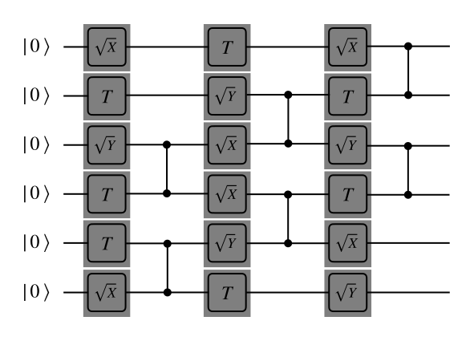

Python scripts used for bitstrings generation in research paper [arXiv:2107.09894](https://arxiv.org/abs/2107.09894).

## Prerequisites
We use [Qiskit](https://qiskit.org) framework in this research. It is possible to install it with `pip` python package manager:
```sh
pip install qiskit
```

## Installation
There is no need to install anything from this repository. 
One can simply clone this repository and use python or shell scripts:
```sh
git clone git@github.com:omsotnikov/bit-strings-dissimilarity.git
```

## Usage
The repository contains three python scripts and the shell script with samples.
Each python script takes a number of parameters with command line.
You can invoke any script with `--help` key to see short description of these parameters. 
```sh
python3 ./cats.py --help
```
Alternatively, you can inspect [experiments.sh](./experiments.sh) shell script to see calculations used in the paper. Execution of this script will reproduce all bitstrings used in the research. Each script produces a text file containing generated bitstring. File name depends on script and chosen parameters and follow the below pattern: 
```
state_type.basis_type.parameter=value.dat
```
Alongside with calculations made in paper one can use these scripts to generate states with different parameters. Below we will describe each script in detail.

### Schrödinger cat states
The state is described by equation (see [paper](https://arxiv.org/abs/2107.09894)):

<p align="center">
  
</p>

and can be modelled with the following quantum circuit

<p align="center">
  
</p>

Script [cats.py](./cats.py) is able to generate Schrödinger cat states and takes the following arguments:
- `-n` - number of measured experiments in resulting bitstring;
- `--qbits` - number of qubits in circuit (> 1);
- `--basis` - type of measurement basis (z or random);
- `--theta` - theta angle in the above equation.

### Dicke states

The following expression is a Dicke state (see [paper](https://arxiv.org/abs/2107.09894)):

<p align="center">
  
</p>

Script [dicke.py](./dicke.py) is able to generate Dicke states and takes the following arguments:
- `-n` - number of measured experiments in resulting bitstring;
- `--qbits` - number of qubits in circuit (> 1);
- `--basis` - type of measurement basis (z or random);
- `-D` - the value of D parameter in the above equation.

### Chaotic circuits
Script [chaotic.py](./chaotic.py) is able to generate chaotic states (presented in research [Phys. Rev. Lett. **126**, 230501](https://doi.org/10.1103/PhysRevLett.126.230501)). The sample quantum circuit of chaotic state is presented below.

<p align="center">
  
</p>

The script could build a chaotic state for 16 qbit circuit and takes the following parameters:
- `-n` - number of measured experiments in resulting bitstring;
- `--basis` - type of measurement basis (z or random);
- `--depth` - number of layers (one layer consists from single and consequent CNOT gates) in the circuit.

In addition to above parameters script [chaotic.py](./chaotic.py) allows to save generated circuit with and use it for later calculations. For example:

```sh
python3 ./chaotic.py --depth 16 --save chaos.pkl
python3 ./chaotic.py --load chaos.pkl -n 1024
```

In the above example the script generates a chaotic chain with 16 layers, saves it using `pickle` python module and exit. Then this chain is loaded and simulated generating a bitstring from 1024 shots of quantum simulator. 
